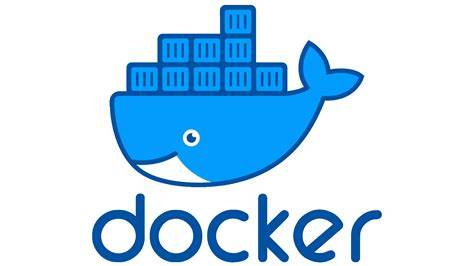
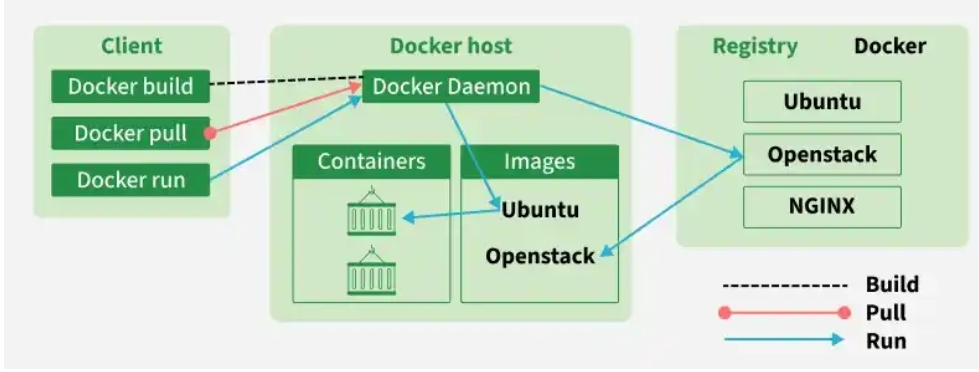
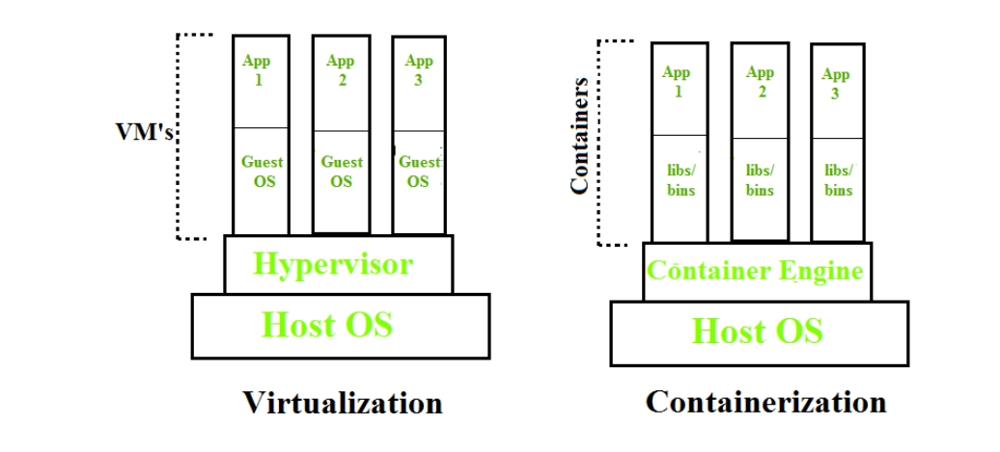
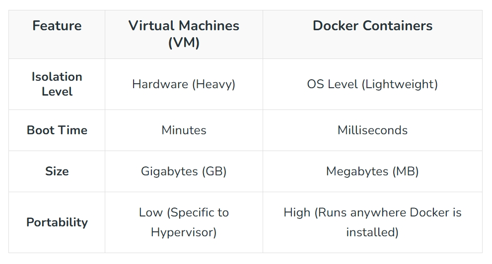
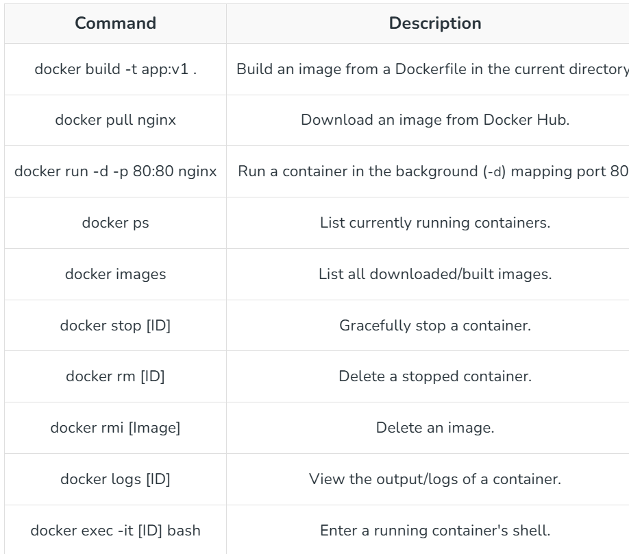
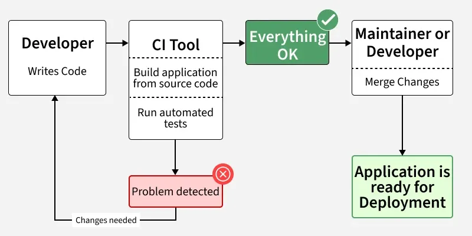
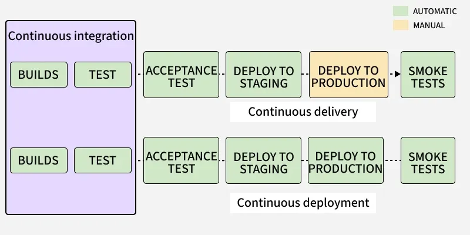

# Docker

**Docker** is a popular platform used to create, manage, and run containers. It simplifies containerization by providing tools to build container images and deploy them easily.

Containers have the program itself and everything required for it to work (libraries, dependencies, and configuration). It ensures that the program runs uniformly regardless of whether it’s on your local machine or another computer/server.

## What Is the Purpose of Docker?

We use Docker to simplify **software development and deployment processes**.

## Why do we need Docker?

1. **Portability**

    It guarantees that the application **works consistently on any machine**, regardless of whether it is a desktop, a server, or the cloud.

2. **Deployment ease**

    Software products can be **deployed rapidly via containers**.

3. **Dependable dependency management**

    The container holds all the libraries and dependencies needed by the software program, thereby minimizing issues with compatibility.

4. **Encapsulation**

    The software runs within **its own container**, thus avoiding conflicts with other software programs.

5. **Resource efficiency**

    Compared to virtual machines, containers **require less memory**, making them more efficient.

6. **Development and testing**

    Developers can conveniently test software programs in **an environment identical to the one used during deployment**.
    

## Advantages of DevOps

1. **Faster Software Development**
    
    DevOps helps teams develop and release software quickly.
    
2. **Better Collaboration**
    
    It improves communication between development and operations teams.
    
3. **Continuous Integration and Delivery (CI/CD)**
    
    Changes can be tested and deployed automatically, reducing manual work.
    
4. **Improved Quality**
    
    Frequent testing helps detect and fix errors early.
    
5. **Faster Problem Resolution**
    
    Issues can be identified and solved quickly.
    
6. **Higher Efficiency**
    
    Automation of tasks reduces time and human errors.
    
7. **Better Customer Satisfaction**
    
    Faster updates and improvements lead to better user experience.

## Docker Architecture and Working

Docker makes use of a client-server architecture.

The communication between the docker client and the daemon makes possible the creation, execution, and distribution of the docker containers.The docker client can be run along with the daemon within the same machine, or we can use the connection between the docker client and the docker daemon from a remote location.Through the REST API, the docker client and daemon communicate using the UNIX socket or through the network.
### Docker Architecture

Docker architecture describes **how Docker components work together to create and run containers**.

### Main Components of Docker Architecture

1. **Docker Client**
    
    The Docker Client is the interface used by users to interact with Docker.
    
    Users run commands like `docker build`, `docker run`, and `docker pull`.
    
2. **Docker Host**
    
    The Docker Host is the system where Docker runs. It contains the Docker Engine, containers, and images.
    
3. **Docker Engine (Docker Daemon)** 
    
    The Docker Engine is the core component that builds, runs, and manages containers.
    
4. **Docker Images** 
    
    Docker images are read-only templates used to create containers. They contain the application and required dependencies.
    
5. **Docker Containers**
    
    Containers are running instances of Docker images where the application actually runs.
    
6. **Docker Registry**
    
    A Docker Registry stores Docker images.

    Example: Docker Hub, where users can download and upload images.

## Introduction to Containerization and Docker
**Containerization** is a technology that allows applications to be packaged together with their dependencies, libraries, and configuration files into a container. This ensures the application runs consistently across different environments, such as development, testing, and production.

A **container** is a lightweight, portable unit that includes everything needed to run an application.

## Virtualization vs. Containerization

## Docker Commands

## Advantage of docker 
1. **Speed** - The speed of Docker containers compared to a virtual machine is very fast. The time required to build a container is very fast because they are tiny and lightweight.

2. **Portability** - The applications that are built inside docker containers are extremely portable. These portable applications can easily be moved anywhere as a single element and their performance also remains the same.

## What is CI/CD?
**CI/CD** stands for:

- **CI (Continuous Integration):** Automatically integrating and testing code changes.
- **CD (Continuous Delivery / Continuous Deployment):** Automatically delivering or deploying applications.
 
## The Three Pillars of CI/CD
1. Continuous Integration (CI)
2. Continuous Delivery (CD)
3. Continuous Deployment (CD)

## CI workflow

## CI and CD Workflow

## Common CI/CD Tools
1. Jenkins 
2. GitHub Actions 
3. GitLab CI/CD 
4. Concourse
5. GoCD 
6. Spinnaker 
7. Screwdriver 

