# TaskFlow To-Do List Application

## Project Title
TaskFlow To-Do List Application

## Description
TaskFlow is a full-stack to-do list application that helps users manage daily tasks through a clean and modern interface. Users can add tasks, view task statistics, filter tasks by status (All, Active, Completed), mark tasks as complete, and delete tasks.

The frontend is built with React, and the backend is built with Express. The backend supports two storage modes:
- In-memory storage for simple local testing.
- Supabase storage when environment variables are configured.

## Features
- Add new tasks
- View total, active, and completed task counts
- Filter tasks by All, Active, and Completed
- Mark tasks as completed with checkboxes
- Delete tasks
- Modern responsive UI with light/dark mode toggle
- REST API backend for task operations
- Dockerized backend and frontend services
- Render deployment support

## Technologies
- Frontend: React, CSS
- Backend: Node.js, Express, CORS
- Database/Cloud: Supabase (optional via environment variables)
- Containerization: Docker, Nginx (for frontend container)
- Deployment: Render
### 4. Optional environment setup (backend)
To use Supabase, create a `.env` file in the `backend` folder:
```env
SUPABASE_URL=your_supabase_project_url
SUPABASE_ANON_KEY=your_supabase_anon_key
PORT=5000
```
If these values are not provided, the backend falls back to in-memory storage.

### 5. Optional environment setup (frontend)
To connect frontend to deployed backend, add a `.env` file in `frontend`:
```env
REACT_APP_API_URL=https://be-todo-02240363-6ee4.onrender.com
```

## Docker Commands

### Backend image
```bash
cd backend
docker build -t sonambulbulwangmo/be-todo:02240363SW .
docker push sonambulbulwangmo/be-todo:02240363SW
docker run -p 5000:5000 --name be-todo sonambulbulwangmo/be-todo:02240363SW
```

### Frontend image
```bash
cd frontend
docker build -t sonambulbulwangmo/fe-todo:02240363SW .
docker push sonambulbulwangmo/fe-todo:02240363SW
docker run -p 3000:80 --name fe-todo sonambulbulwangmo/fe-todo:02240363SW
```


### Running in Local host 
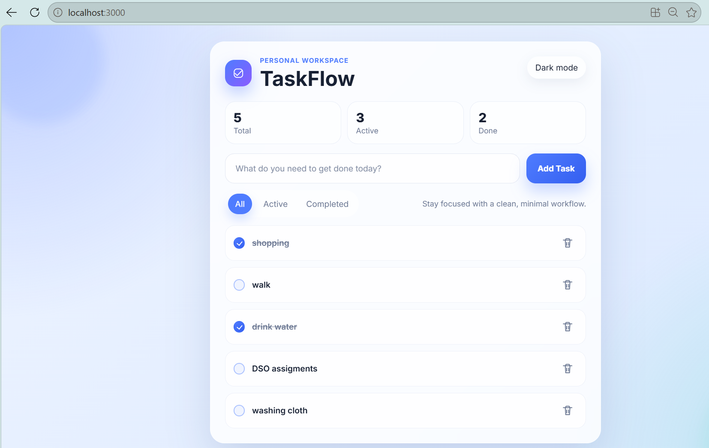


This is an image of a modern and clean **TaskFlow to-do list application**, which is running on `localhost:3000`. The app has a soft blue and white color theme, along with a simple dashboard design. The stats for tasks, including total, active, and completed, are displayed here. New tasks can be added, and there is also a tab feature that lets users choose from All, Active, and Completed options. Tasks can be marked as completed via check boxes, and tasks can be deleted via the trash bin icon.

## Backend running in terminal
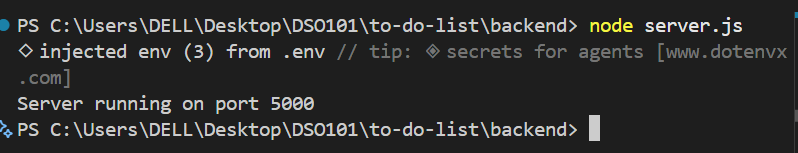
This is the backend running in the terminal
## Docker login
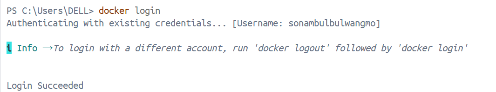
Docker login to build image


## Docker backend build 
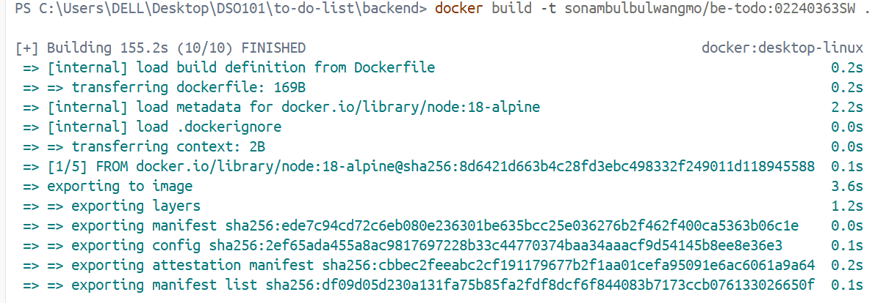
The picture is that of a successful Docker image build in the terminal window. The command used was `docker build -t sonambulbulwangmo/be-todo:02240363SW .`, which ran successfully to create and export the Node.js app image based on the `node:18-alpine` base image.
## Docker pushed
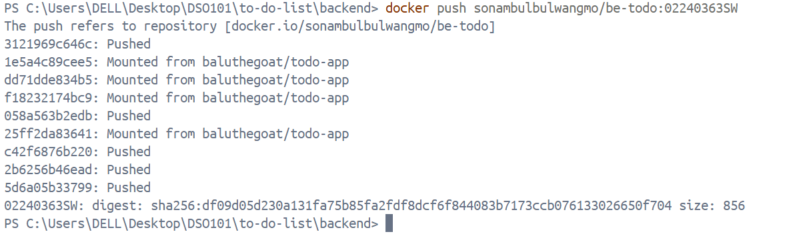
This image shows the Docker image for the backend  being pushed to the registry.
## backend image pushed in docker hub
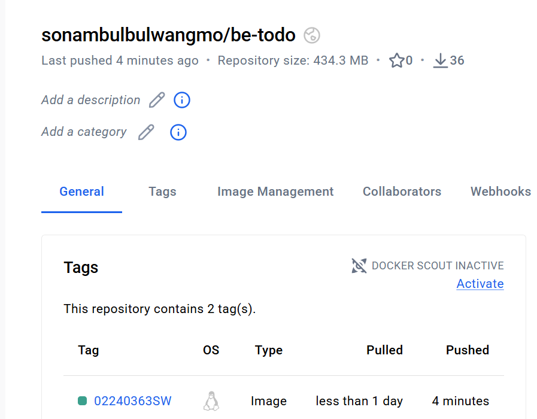

## Docker build
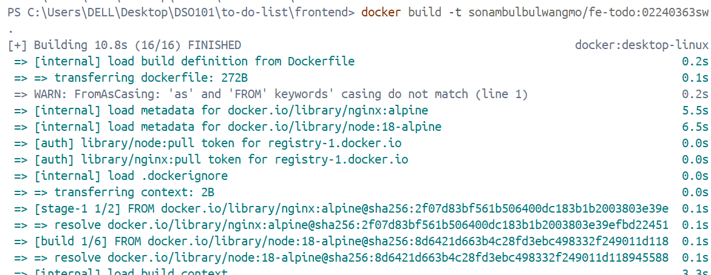
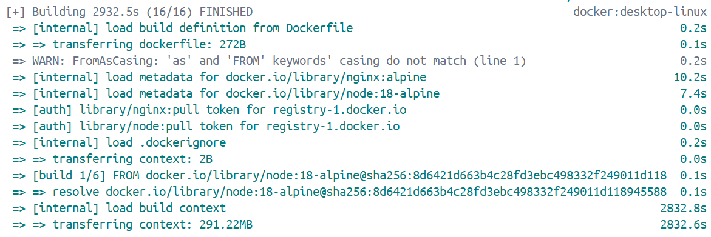

## docker pushed 
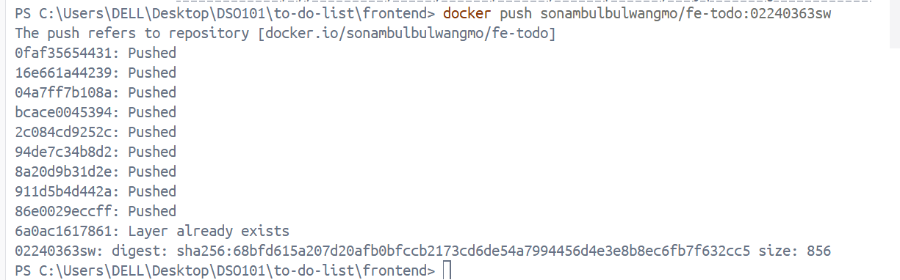
Frontend pushed  complete 

## Render deploy (backend)
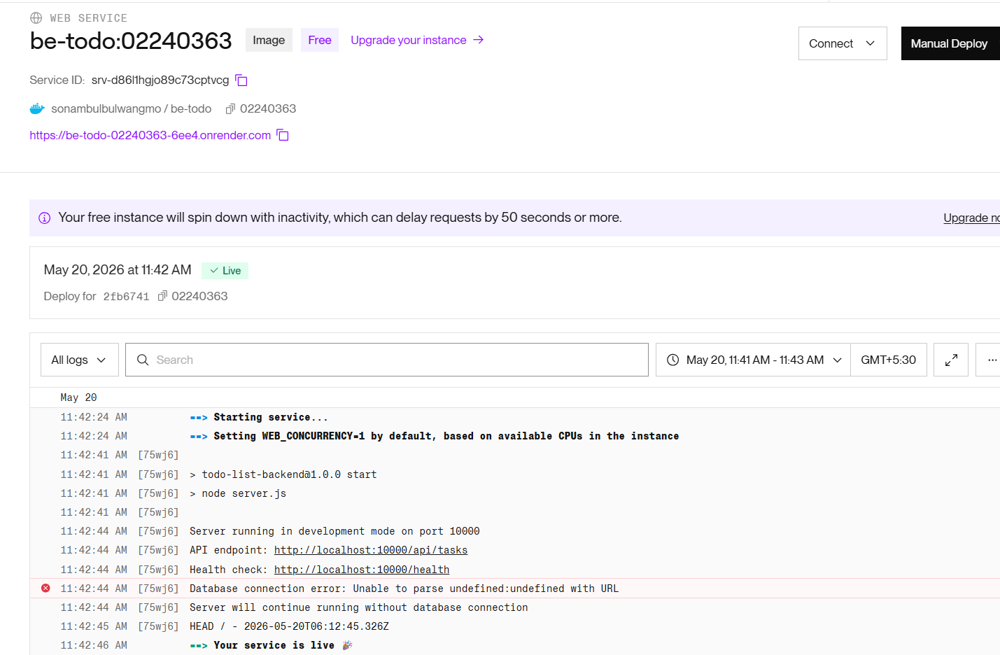

## live backend 
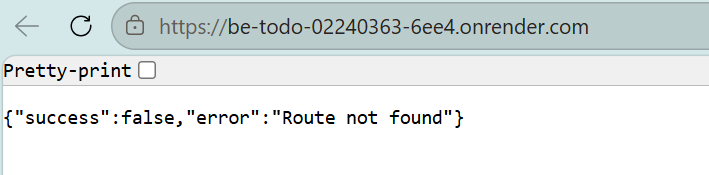


 
## Render deploy (frontend)
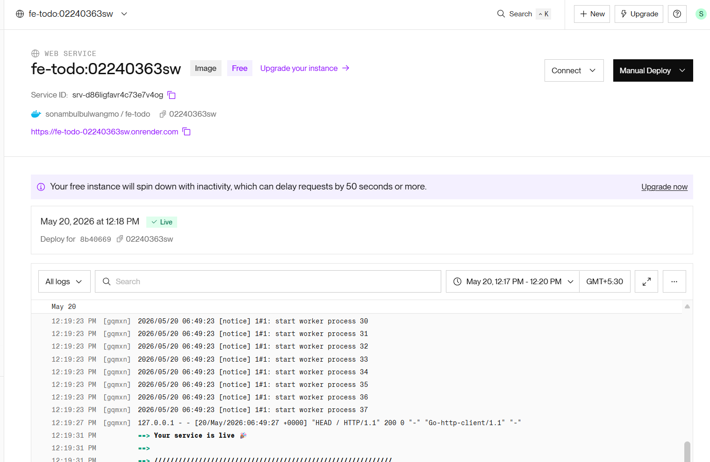

## live frontend 
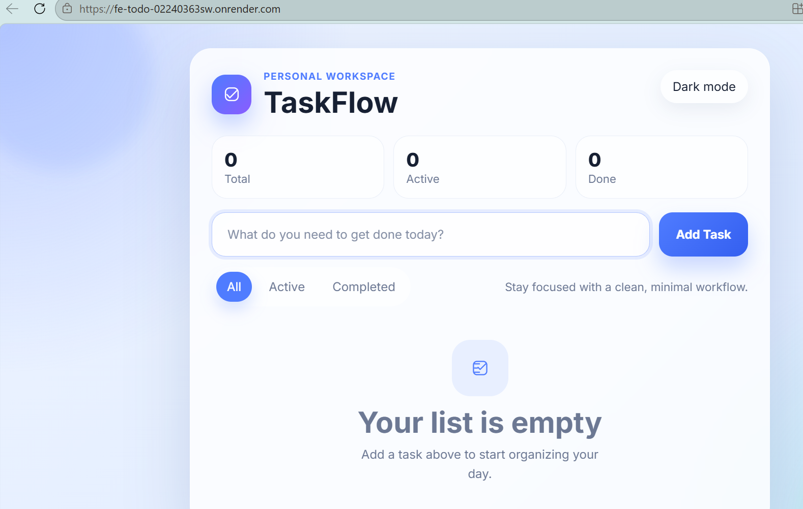


## Challenges
- Configuring frontend and backend communication across local and deployed environments.
- Managing environment variables for Supabase and API URLs.
- Building and validating separate Docker images for backend and frontend.
- Ensuring deployment configuration on Render for both services.
- Keeping task data behavior consistent between in-memory and Supabase-backed modes.

## Learning Outcomes
- Built a complete full-stack application with React and Express.
- Learned REST API integration between frontend and backend.
- Practiced Docker image creation, tagging, pushing, and container execution.
- Improved deployment workflow knowledge using Render.
- Strengthened understanding of environment-based configuration in production apps.

## Deployment Link
- Backend (Render): https://be-todo-02240363sw.onrender.com
- Frontend (Render): https://fe-todo-02240363sw.onrender.com/


