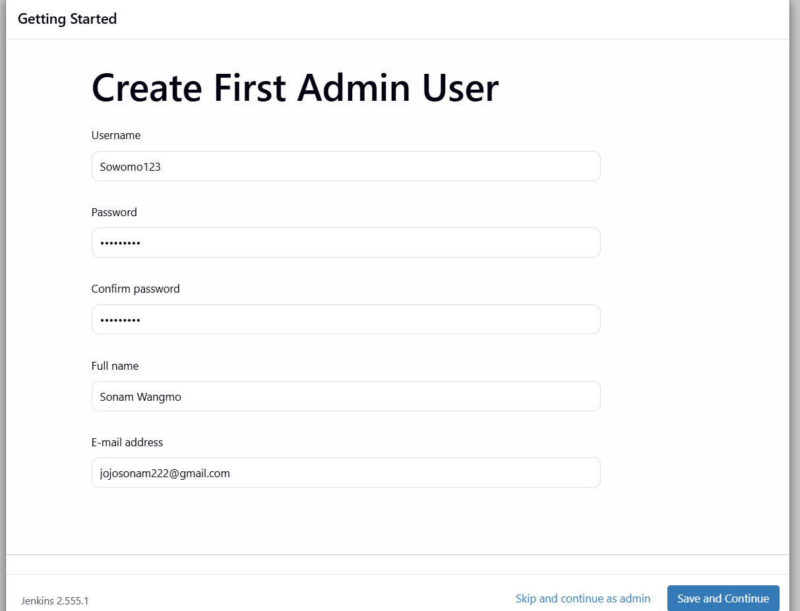
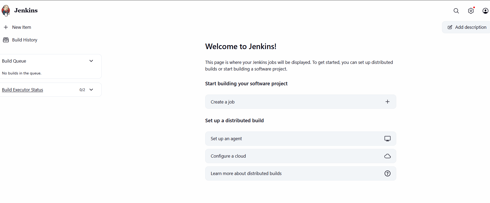
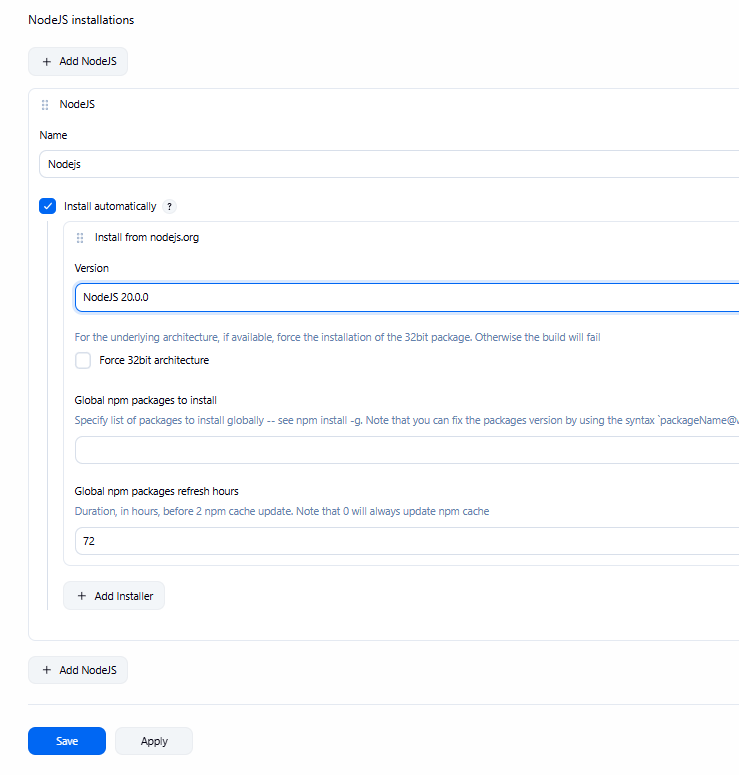

# Automated CI/CD Pipeline for Node.js To-Do Application using Jenkins

## Description

This project demonstrates the implementation of a Continuous Integration and Continuous Deployment (CI/CD) pipeline using Jenkins for a Node.js-based To-Do web application. The pipeline automates the entire software delivery process — from pulling the latest code from GitHub, installing dependencies, running unit tests, building the project, to finally building a Docker image and pushing it to Docker Hub.

This assignment showcases how modern DevOps practices can be applied to streamline and automate the software development lifecycle.

---

# Features

- Automated pipeline triggered from a GitHub repository
- Five-stage Jenkins pipeline:
  - Checkout
  - Install
  - Build
  - Test
  - Deploy
- Unit testing using Jest with JUnit report generation
- Test results visible directly inside Jenkins dashboard
- Automated Docker image build on every pipeline run
- Docker image pushed automatically to Docker Hub registry
- Environment-based configuration using credentials stored securely in Jenkins
- Pipeline status notifications for success and failure

---

# Technologies Used

| Technology | Purpose |
|---|---|
| Node.js | Backend runtime environment |
| Express.js | REST API framework |
| React.js | Frontend user interface |
| Jest | Unit testing framework |
| jest-junit | Generates JUnit XML reports |
| Docker | Containerization platform |
| Docker Hub | Remote Docker image registry |
| Jenkins | CI/CD automation server |
| GitHub | Source code hosting and version control |
| Jenkinsfile | Pipeline-as-code configuration |

---

# Pipeline Stages

| Stage | Description |
|---|---|
| Checkout | Pulls the latest code from GitHub |
| Install | Installs project dependencies using `npm install` |
| Build | Builds the application using `npm run build` |
| Test | Runs Jest tests and generates `junit.xml` |
| Deploy | Builds Docker image and pushes it to Docker Hub |

# Jenkins Pipeline Execution

The Jenkins pipeline performs the following steps automatically:

1. Pulls latest source code from GitHub
2. Installs project dependencies
3. Builds the application
4. Executes unit tests
5. Generates JUnit test reports
6. Builds Docker image
7. Pushes Docker image to Docker Hub

---

# Challenges Faced

## Jenkins and Java Setup
Jenkins required JDK 17+ for proper execution. Configuring the correct Java version and setting the `JAVA_HOME` variable correctly required troubleshooting.

## Plugin Configuration
Configuring Jenkins plugins such as:
- NodeJS Plugin
- Docker Pipeline Plugin
- GitHub Integration Plugin

required careful setup and compatibility checks.

## GitHub PAT Authentication
Generating and securely storing a GitHub Personal Access Token (PAT) with proper repository permissions was an important challenge.

## Jest and JUnit Integration
Configuring `jest-junit` to generate `junit.xml` in the correct location for Jenkins to display test reports required additional setup.

## Docker Credentials in Jenkins
Matching Docker credential IDs correctly inside the `Jenkinsfile` and securely storing credentials in Jenkins was necessary for successful deployment.

## Pipeline Debugging
Learning to read Jenkins console logs and troubleshoot failing stages improved debugging and CI/CD troubleshooting skills.

---

# Learning Outcomes

- Understood CI/CD concepts and DevOps workflow
- Learned Jenkins installation and configuration
- Gained experience writing Jenkins declarative pipelines
- Integrated Jest automated testing into CI pipeline
- Learned Docker image creation and Docker Hub deployment
- Connected GitHub repositories securely with Jenkins
- Improved debugging and automation skills
- Developed a practical understanding of DevOps practices

---

# Screenshots

## Jenkin Setup

`` username: Sowomo123``
`` Password: Sowomo123``

## Jenkins Dashboard

 
## Configure Node.js in Jenkins

 

# Token 
