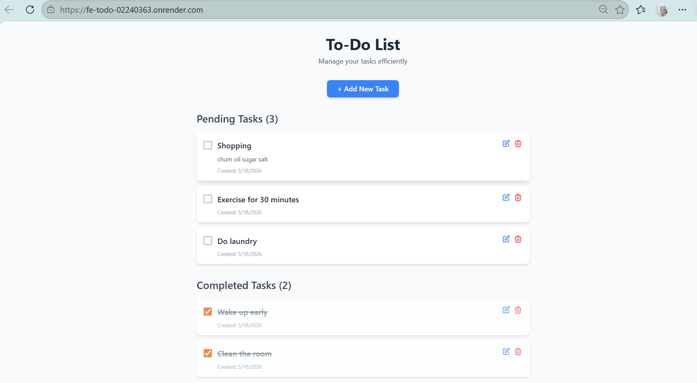

# Overview

This assignment demonstrates the development, containerization, and deployment of a full-stack To-Do List web application using Docker, Docker Hub, GitHub, and Render.com.

The project contains:

- Frontend (UI)
- Backend (CRUD API)
- Database (PostgreSQL)
- Dockerized services
- Automated deployment using Render Blueprint (`render.yaml`)

---

# Technology Stack

## Frontend
- React.js

## Backend
- Node.js
- Express.js

## Database
- PostgreSQL

## DevOps / Deployment
- Docker
- Docker Hub
- Render.com
- GitHub

## Features Implemented
## Frontend Features
- Add Tasks
- Edit Tasks
- Delete Tasks
- Display Task List


- Link ([frontend link](https://fe-todo-02240363.onrender.com/))

## Backend Features
- REST API CRUD Operations
- Create Task
- Read Task
- Update Task
- Delete Task


- Link ([backend link](https://be-todo-02240363.onrender.com/))


## Part A: Manual Docker Build & Push to Docker Hub

### Step 1: Build Docker Images

**Backend Image:**
```bash
cd backend
docker build -t yourusername/be-todo:02240363 .
``` 


#### Frontend Service
1. Click **New** → **Web Service**
2. Select **"Existing image from Docker Hub"**
3. **Image URL:** `yourusername/fe-todo:02240363`
4. **Name:** `fe-todo-02240363`
5. **Environment Variables:**
   - `VITE_API_URL`: `https://be-todo-02240363.onrender.com` (your live backend URL)
6. Click **Create Web Service**


### Results
- **Frontend Live URL:** https://fe-todo-02240363.onrender.com
- **Backend Live URL:** https://be-todo-02240363.onrender.com

---


## Deployment Links

| Service | Link |
|---------|------|
| Frontend | https://fe-todo-02240363.onrender.com |
| Backend API | https://be-todo-02240363.onrender.com |
| API Documentation | https://be-todo-02240363.onrender.com/api |

---

## Troubleshooting

### Images Not Displaying
- Ensure image paths use `./public/images/` (plural)
- Check file names match exactly (e.g., `backend .png` with space)

### Deployment Failures
- Check Render logs: `Render Dashboard → Service → Logs`
- Verify environment variables are set correctly
- Ensure Docker images are public on Docker Hub

### Database Connection Issues
- Verify `DB_HOST`, `DB_USER`, `DB_PASSWORD` are correct
- Check PostgreSQL is running and accessible
- Ensure database name exists

### Frontend Cannot Connect to Backend
- Verify `VITE_API_URL` matches live backend URL
- Check CORS headers in backend
- Ensure backend service is running

---

## References

- [Docker Documentation](https://docs.docker.com/)
- [Render Documentation](https://render.com/docs)
- [Render Blueprint Spec](https://render.com/docs/blueprint-spec)
- [Environment Variables Best Practices](https://12factor.net/config)
- [React Documentation](https://react.dev)
- [Express.js Documentation](https://expressjs.com/)
- [PostgreSQL Documentation](https://www.postgresql.org/docs/)

---
